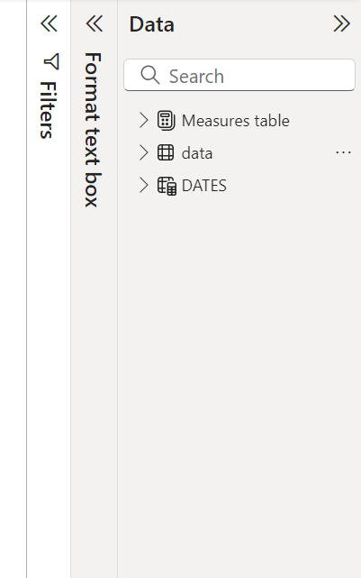
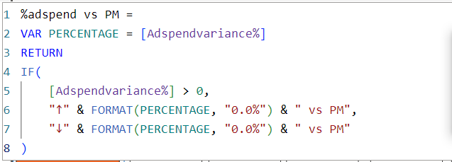
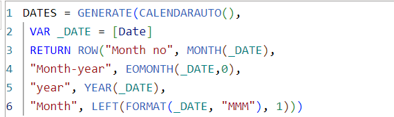
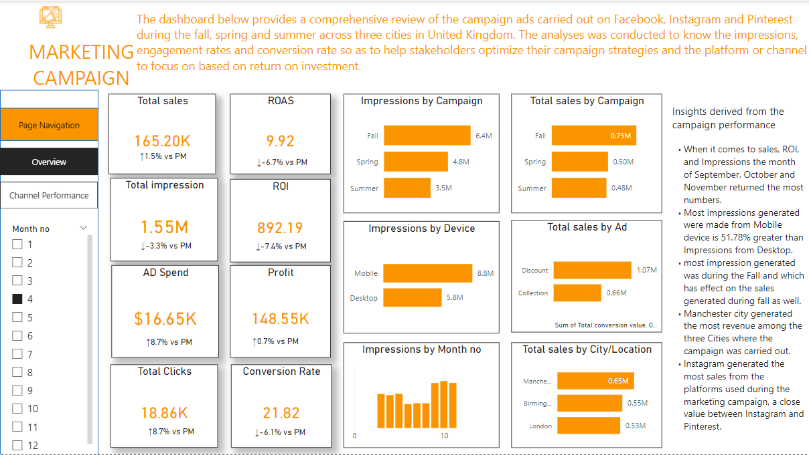
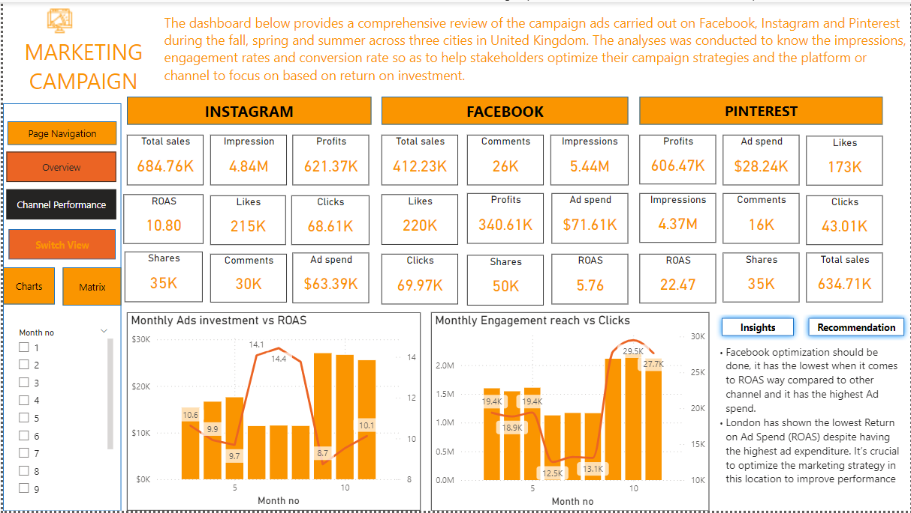
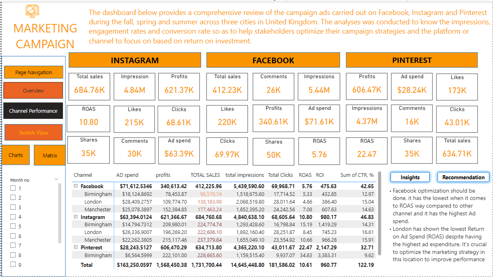

# Marketing campaign
 Enhancing Campaign Performance in Key Markets
 ## Project overview
 ### Introduction 
 In today's world, businesses are competitive so they invest heavily in marrketing campaigns to promote
 their products across different channels. This project was done to analyze the performance of multiple marketing 
 campaign across different cities, channnels and devices to gain insights that can drive decision making and 
 better ROI (Return on Investment)
 ### Objectives
 The datasets was used to generate insights that can be make businesses make data driven decision and strategic  
 planning to better ROI. I also made analysis to identify geographical impacts, channel insights, conversion value 
 assessment, impression trends, and Ads trends. 
 ### Problem statement
 The marketing team in the organization are phased to know the which campaigns are returning the best results 
 in terms of ROI. There is a detailed analysis made to uncover which cities, channels, and devices contributing
 most to the engagement, conversions and revenue generated. 

 ## Data description 
 ### About the datasets
 The datasets offers a thorough summary of the important and characteristics related to marketing campaignsconducted through a
 variety channels, devices, and cities. it is intended to monitor the reach, engagements, cost, revenue of every campaign made 
 for products. 
 ### columns and description
 - Campaign: the data type is text, this is the period in which the campaign was carried out, like Spring, Fall, and Summer
 - Date: the data type is Date, this is the time and date in which the campaign was carried out.
 - City: the data type is Text, this is the cities in which the campaigned where directed to mainly three Cities in the UK
 - Device: the data type is Text, this is the device that generated the most engagement and conversions
 - Ad: the data type is text, it discribes how the adverts or campaign was done wether collection or discount
 - Impressions:the data type is Decimal number,it describes the number of times the ad was displayed to users
 - CTR (Clickthrough Rate): the data type is Decimal number, it describes the percentage of impressions that resulted in clicks
 - clicks: the data type is decimal number, the column describes the number of times users clicked on the ad
 - Daily average CPC: the data type is Decimal number, the column describesthe  average cost incurred for each click on the ad
 - spend: the data type is fixed decimal number, this describes the total amount of money spent on the campaign
 - Conversion: the data type is whole number, the column describes number of desired actions (e.g., purchases, sign-ups) completed as a
   result of the campaign
 - Total conversion value: the data type is whole number, this describes total monetary value generated from conversions.
 - Likes: the data type is decimal, it is the number of likes the ad received on social media platforms.
 - Shares: the data type is whole number, the number of times the ad was shared by users.
 - Comments: the data type is whole number, the number of comments made by users in response to the ad.

   ### Tools used;
   The only tool used during the analysis was Power BI it was used for cleaning, analysis and visualization. the KPI was generated
   using power bi as well.

   ## Dataprocessing
   ### Data cleaning
    #### Handling missing values;
   Data cleaning was done using power query function in Power BI and no missing values was found after filtering the columns.
   #### Data conversion;
   The only column the data type was converted was the Spend column to Fixed Decimal number from decimal number
   #### Duplicate;
   Remove duplicate function from the ribbon was used to remove duplicates but none was detected in the table so the entire table
   was a clean table.
   ### Data transformation
   New column was created using the new measures function to create important KPIs so as to find metrics to make us make better decision.
   new measures created for ROAS, ROI, profits, conversion rate.
   - Total sales; SUM(Total conversion value, GBP)
   - AD spend; sum(spend)
   - Conversion rate; conversions/clicks * 100
   - Profits: Total sales - Ad spend
   - ROAS = Total sales/ Ad spend
   - ROI = Total conversion rate - Spend)/spend * 100
   New table was created for Date table and Measure tables to calculate the percentage change of each KPI per previous month.
    
   
   ### KPIs
   - Total sales; 1,730,000 was the total revenue generated from the campaign
   - Profits; The profit made from the whole campaign was 1,570,000
   - ROAS (Return on Ad spend); per ad spent 10.61 was made
   - ROI (return on investment); per the amount spent on campaigns 960.77 was made.
   - Impressions; The total number of times the ad was seen was 14,650,000
   - conversion rate; the rate was at 22.17
   - total clicks; 181,590 was the total number of times the ads was clicked on.
   ## Exploratory Data analysis
   The datasets includes essential metrics for different campaigns such as campaign period, cities, devices, channels, click through rate,
   cost per click, ad, impression and engagement metrics such as shares, likes, and comments. The goal of EDA is to uncover important patterns
   and correlation between two variables and opportunities for improvement.
   - Impressions by Campaign: This analyzed the period of campaign that has the most impression, Fall has the most number of impression with
     6,400,000 impression followed by Spring and Summer with 4,800,000 and 3,500,000 respectively.
   -  Total sales by campaign: Fall generated the most revenue with 750,000 pounds from the three campaign period.
   -  Impression by Device: The device used for engagement metrics is the mobile , it generated more impreesions compared to Desktop.
   -  Total sales by Ad : the discounted ad made more revenue compared to the collection ad with huge difference of 1M+ pounds
   -  Impression by month: September, October and November were the most active for campaigns it returned the most impresssions
   -  Total Sales by Cities: London returned the lowest sales despite having the most ad spend from the two other cities, Birmingham and Manchester.
   -  Total sales by channels: Instagram returned the most sales with 684,760 pounds while Facebook returned the least with 412,230 pounds
   -  ROAS by channels: Pinterest generated the most per ad spend 22.49 pounds was made while Facebook returns on ad spend was very low compared
      to the other two channels.
   - Engagement rate by Channel: Pinterest generated the lowest engagement rate compared to the other two channel
   - ROAS by Cities: London has the lowest Return on ad spend from the three cities the campaign was done.
   - Correlation between Clicks and Impression: The higher the impressions the higher the clicks generated and vice versa.
   - Monthly Ad spends and ROAS: June, July, August has the lowest Ad spend but the highest ROAS compared to other month, while September to October has
     lowest ROAS with the highest Ad spent.
       
     ## Insights
   - London has the lowest ROAS despite high spend, suggesting that campaigns in this city require reevaluation and potentially a different approach.
   - Social media channels and mobile devices are driving the highest engagement, indicating the importance of optimizing content for these platforms.
   - Manchester city generated the most revenue among the three Cities where the campaign was carried out.
   - When it comes to sales, ROI, and Impressions the month of September, October and November returned the most numbers.

     The dashboard consists of page navigation and bookmarks that can use to navigate from the first dashboard to the second dashboard and to switch between
     charts and matrix. On the dashboard, you can switch between viewing monthly trends for engagement and clicks and the table for KPIs.
       
   # Conclusion and Recommendation
   - Focus on improving ROAS in London by testing different creatives, messages, and targeting strategies
   - Continue investing in channels and devices that show high engagement and conversions, especially mobile and instagram
   - Facebook optimization should be done, it has the lowest when it comes to ROAS way compared to other channel and it has the highest Ad spend. 
   - London has shown the lowest Return on Ad Spend (ROAS) despite having the highest ad expenditure. It’s crucial to optimize the
     marketing strategy in this location to improve performance
